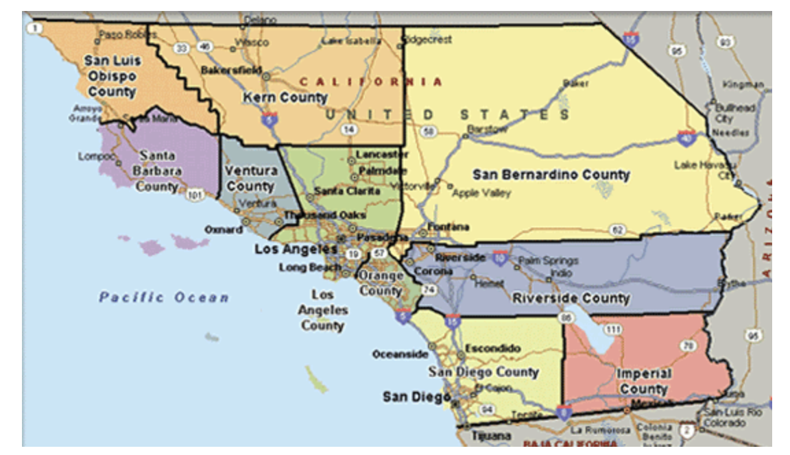
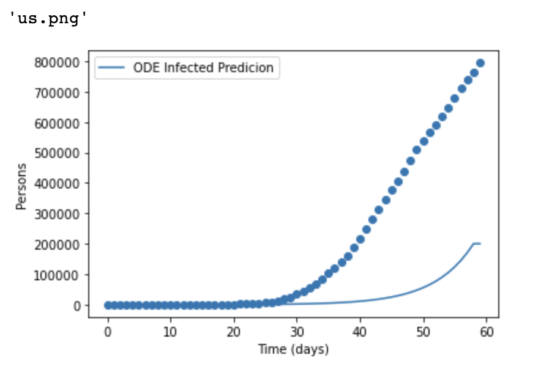
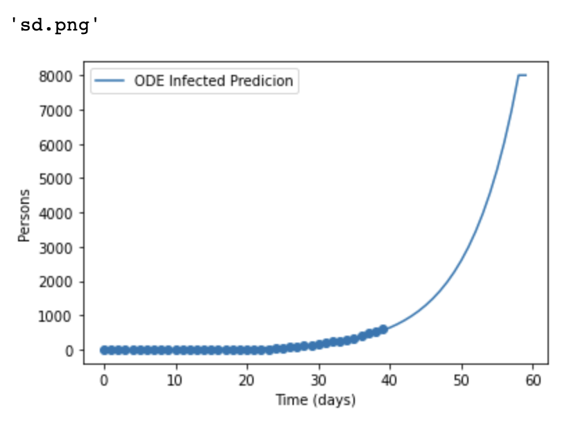

# Using Epidemiology Model To Predict Case Numbers for COVID-19

## Table of contents
* [Website](#io)
* [General info](#general-info)
* [Technologies](#technologies)
* [Setup](#setup)
* [Directions](#directions)
* [Processing](#in_processing)
* [Contact Us](#contact_info)
## Website
https://shuyuan66.github.io/epidemiology_capstone_web/
## General info
- Use covid-19 datasets provided by JHU to fit epidemiology model to U.S. After figuring out the infection parameter, we can then predict infected number for future. 
- 

## Introduction
he early state and late stage of a pandemic is very different. At early stage, the case number grows exponentially. Government agencies and institutions want to the ability to forecast the number of cases in order to allocated medical and other resources. Furthermore, knowing how protocols such as stay at home order can affect the case number is extremely useful to make predictions. However, in order to predict number of cases in the future, the growth factor is needed and can be generated from fitting previous data to an epidemiology model. The exponential factor is based on two factors that can be learned from data: the infection rate, $\beta$ and number of days a patient stays infectious $D$.

## Technology
Project is created with:
- Image : ucsdets/scipy-ml-notebook	

## Setup
- Before running, use `pip install -r requirements.txt` to install all the required packages
- on terminal, run `python run.py data` to retrieve the most current data from JHU & Apple Data

## Directions
`python run.py test` to start

## Processing
We are using gradient descent to find infection rate and infection duration. Then we want to check whether the parameters can predict useful information (accuracy). 

However, in reality, the case numbers of the entire country/state is not evenly distributed among counties. Besides computing the individual infection rate for all the counties, each as a separate entity from its neighbors, we will predict case numbers based on the mobility data provided by Descartes Labs[3] (how fast is people moving inside each county and across county boundaries), and the case numbers of each county's neighboring counties. We will use a $dt$ around 0.001 day instead of 1 day to better predict the dynamics. This process requires a fixed $\beta$ and $D$ predetermined for each county. 

Furthermore, $\beta$ and $D$ are also dynamic. So in the future, we will replace the fixed $\beta$ and $D$ with dynamic, changing according to the data.

The mobility data is representing the distance a typical member of a given population moves in a day. With this data set, we are able to see how stay-at-home orders by different states and the pandemic itself have effect on average mobility trends. The data set also provides additional information for our epidemiology model. 

### Achievements

One of the pressing problems in epidemiology is long term prediction of the spreading of an infectious disease. Of particular interest is how mitigation measures (government policies) can affect the number of infected in the future. Numerous efforts have been tried around the world. Many cities and states in the U.S. have ordered stay-at-home policies. It is useful to see how administering these orders can affect the case numbers, how would the case numbers react if the government revoke the orders.[1]

As our test dataset, We applied our methods to south California.  We obtained the following results:At US country level (Figure 1), the model is underestimating the number of cases.  At state and countylevel (Figure 2 and Figure 3), the model is overestimating the number of cases.
- Figure 1

 

- Figure 2 

 

- Figure 3

### Problem to Solve

- [TODO] Using Apple's mobility data, we are able to fit a Bayesian model and use the model to predict future number of infected with new lockdowns/un-lockdowns. 

## Contact US
- Shuyuan Wang shw276@ucsd.edu
- Caiwei Wang caw062@ucsd.edu
